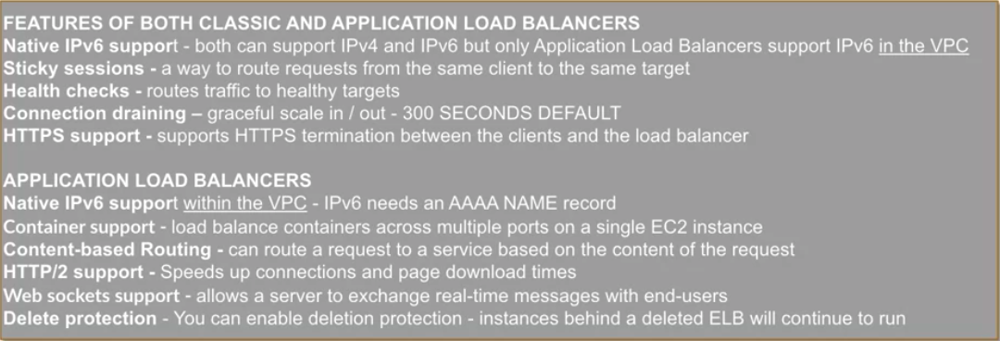

# EC2
* Elastic Compute Cloud
* Tied to AZ (but instance id is tied to region)

## Steps to Create EC2 Instance

### AMI
* Regional
* Private by default
* Types
  * AWS
  * Partner
  * Community
  * Private (My AMIs)

### Instance Type
* Dr McGift Px
* Micro Instances
* General Purpose
* Compute Optimized
* GPU Instances
* Memory Optimized
* Storage Optimized

### Configure Instance
* Number of Instances
* Purchasing Option (Spot Instances)
* Network
* IAM Role
* Shutdown behavior
* Tenancy
* Advanced (User Data)

### Add Storage (types of block devices)
* EBS Volumes (persistent)
  * General Purpose SSD (GP2)
  * Provisioned IOPS SSD (IO1)
  * Magnetic
  * Throughput Optimized HDD (ST1)
  * Cold HDD (SC1)

[reference](http://docs.aws.amazon.com/AWSEC2/latest/UserGuide/block-device-mapping-concepts.html)

### Tag Instance
* Key Value pair
* Case Sensitive

### Security Group
* Virtual firewall that controls traffic to instance
* Limit traffic to trusted IP addresses/ranges
* Regional (max 500 per region)

### Key Pair
* Specific to region

### Review
* Review Configuration
* Verify that you have a Private Key

## Manage your Instance
* Backup
* Security
* Patching
* General Administration
* **Note:** You have to take proper measures to secure your instances under the Shared Security Model

## Pricing
* EC2 Pricing based on Instance Hours

## EC2 limits
* 20 instances per region

## Billing Types
* On-demand
* Spot
* Reserved (1 or 3 year term)
  * Scheduled Reserved
* Dedicated

[reference](https://aws.amazon.com/ec2/pricing/)

### Types of block devices
* Instance Store Volumes (ephemeral)
  * Data persists on reboot
  * Data is lost:
    * Failure of an underlying drive
    * Stopping an Amazon EBS-backed instance
    * Terminating an instance
* EBS Volumes (persistent)

### Types of instances
* *Instance store* backed instance
  * Root device is an **instance store** volume created from a template on S3
  * Can only be rebooted (data saved) or terminated (data lost)
  * **Cannot stop** an instance that was started by an *instance store backed AMI*
  * **Slower** to start (must retrieve **entire** S3 template)
  * Up to **10 GiB**
  * Instance attributes are **fixed** for life of instance

* *EBS* backed instance
  * Root device is on an **EBS volume** that was created from an EBS snapshot
  * Can be stopped (but will lose ephemeral storage)
  * **Quicker** to start (only need part of EBS snapshot to boot OS)
  * Up to **16 TiB**
  * Upgrades can happen when instance is stopped (instance type, kernel, RAM, user data)

## Termination protection
* EBS backed instances only
* Prevent termination from API or AWS Console
* `modify-instance-attribute--disable-api-termination`

## Metadata
* http://169.254.169.254/latest/meta-data/

## Tags
* Can only tag instance that already exists
* Cannot terminate, stop, start instance by tag (must specify **instance id**)

## Auto Scaling Groups
* Enables you to scale your instances based on load, time of day or a pre-defined schedule
* Must have **Launch Configuration** and **minimum size**

```
aws autoscaling describe-account-limits
```

### Launch Configuration
* Must have **name**, **AMI**, and **instance type**
* Storage
* **Note:** Once created, it cannot be changed.  Must create a new LC if you need something different.  This is to ensure consistency of EC2 instances launched by Auto Scaling Groups.
  * If you update your ASG's launch configuration, then new instances will use the updated LC. Existing instances are unaffected.
* **Note:** Launch configuration cannot add an **existing** instance to an auto scaling group
* **Limit:** 100 launch configurations per region

[Launch Configuration](http://docs.aws.amazon.com/autoscaling/latest/userguide/LaunchConfiguration.html)

### Auto Scaling Group
* Launch Configuration
* Desired capacity
* VPC and relevant subnets
* **Scaling Policies**
  * Trigger scale up or scale down events *(can use CloudWatch metrics)*
  * Schedule *(time of day)*
* Can create custom [termination policy](http://docs.aws.amazon.com/autoscaling/latest/userguide/as-instance-termination.html)
  * If AZs are unbalanced, then your termination policy is applied to the **heavy** AZ
  * If AZs are balanced, all instances are considered
* **Instance protection**
  * Can set for an Auto Scaling group or an individual Auto Scaling instance
  * Does not protect from manual termination (API, console)
* **Limit:** 20 auto scaling groups per region
* **Note:** no additional charges

* [Processes](http://docs.aws.amazon.com/autoscaling/latest/userguide/as-suspend-resume-processes.html) *(can suspend / resume)*
  * Launch
  * Terminate
  * HealthCheck
  * ReplaceUnhealthy
  * AZRebalance
    * If AZ goes down, launch new instances **first** and then terminate unhealthy instances
  * AlarmNotification
  * ScheduledActions
  * AddToLoadBalancer

suspend process

```
aws autoscaling suspend-processes \
--auto-scaling-group-name my-asg  \
--scaling-processes AlarmNotification
```

suspend all

```
aws autoscaling suspend-processes \
--auto-scaling-group-name my-asg
```

resume process

```
aws autoscaling resume-processes \
--auto-scaling-group-name my-asg \
--scaling-processes AlarmNotification

```

resume all suspended processes

```
aws autoscaling resume-processes \
--auto-scaling-group-name my-asg
```

## ELB
* Elastic Load Balancers
* Software load balancer that is an integral part of building a fault tolerant, highly available system.
* HTTP, HTTPS, TCP, SSL
* Takes requests and distribute traffic across AWS resources (usually EC2 instances)
* Can be **public facing** or **internal**
* ELB detects the health of an instance
  * Stops sending traffic to an instance if it's not healthy
  * Need an ASG if you want to add or remove instances
* ELB can balance across multiple AZs with **cross-zone load balancing**
  * Reduces the possibility of client cached DNS information resulting in requests being distributed unevenly
* If you delete an ELB, the instances continue to run

#### Types
* Classic ELB (layer 4 of OSI model)
* Application ELB (layer 7 of OSI model)



### Listener
* Process that checks for connection requests
  * Protocol and port for a **front** end connection
  * Protocol and port for a **back**  end connection *(EC2 instance, lambda, etc.)*
* ELB must have at least one listener
* ELB holds **2 connections** *(front and back)*

#### ELB Monitoring
* **ELB** CloudWatch monitoring is at **1 minute** intervals by default
  * best practice is to store access logs in S3

#### Auditing
* Can use CloudTrail to track ELB API calls

#### Security
* Security groups
* Can perform **ssl termination**

#### Pricing
* Hours of use
* GB of data processed
* Region of use

## [Elastic IP](http://docs.aws.amazon.com/AWSEC2/latest/UserGuide/elastic-ip-addresses-eip.html)
* Regional (max 5 per VPC per Region)
* Remains associated with instance when it's stopped (EC2-VPC)

## [Placement Groups](http://docs.aws.amazon.com/AWSEC2/latest/UserGuide/placement-groups.html)
* Logical group of instances within a single AZ
* **Low network latency** and **high network throughput**
* Recommended to use same instance types
  * Does not support micro or medium sized instances
* Cannot move **existing** instance into a placement group
  * Can launch a **new** instance into a placement group
* Instances in placement group should use private IPs
  * If they use public IPs then throughput drops to **5 Gbps** or less
* Network traffic to/from resources outside a placement group is limited to **5 Gbps**

## [EC2 ARN](http://docs.aws.amazon.com/general/latest/gr/aws-arns-and-namespaces.html#arn-syntax-ec2)

## EC2 Compute Unit ([ECU](https://aws.amazon.com/ec2/faqs/#What_is_an_EC2_Compute_Unit_and_why_did_you_introduce_it))
