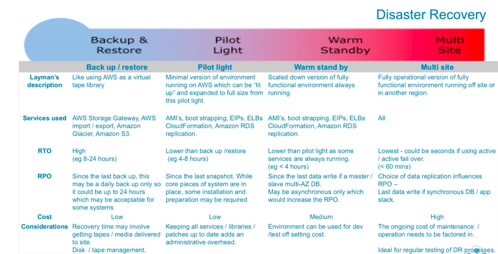

# Designing for high availability, fault tolerant, and cost efficiency
* **Elasticity**: The ability to scale up and down to meet requirements
* **Auto Scaling**
* Leveraging multiple AZ in a region is a good step towards HA and fault tolerance
* Recovery Time Objective (RTO)
* Recovery Point Objective (RPO)
* Business Continuity Planning
* Loosely Coupled Components
  * SQS
* Retrieve Session Data (reduce dep on server state & increase performance)
  * ElastiCache
  * DynamoDB
* Optimizing Business Workflow
  * SWF
  * Lambda
* Design for failure

# Pillars
* Security
* Reliability
* Performance Efficiency
* Cost Optimization

# High Availability Top 10
* Regions
* AZ
* Virtual Private Cloud
* Elastic load balancer
* Simple queue service
* Elastic compute cloud
* Elastic IP address
* Route53
* CloudWatch
* Auto Scaling

# Designing for Disaster Recovery / Business Continuity
* **RTO** - time after disruption to recover to service level
* **RPO** - acceptable amount of data loss (measured in time)

# Disaster Recovery Designs
* Backup and Restore
* Pilot Light
* Warm Standby
* Multi-site

### Backup and Restore
* Considerations
  * Retention time for media
  * Security of archives
  * Requires regular testing

### Pilot Light
* Data is mirrored
* Horizontal scaling is a cost effective & scalable way to add capacity to Pilot Light system

### Warm Standby
* Run smaller version of production environment
*

### Multi-site
* Duplicate production environment
* Direct traffic to both sites
* In event of failure, direct traffic away from failing site

# Testing Recovered Data
* Following are fail-back approaches

### Backup and restore
* Freeze data changes to the DR site
* Take a backup
* Restore the backup to the primary site
* Re-point users to the primary site
* Unfreeze the changes

### Pilot Light, Warm Standby, Multi-site
* Establish reverse mirroring/replication from the DR site back to the primary site, once the primary site has caught up with the changes
* Freeze data changes to the DR site
* Re-point users to the primary site
* Unfreeze the changes

# Replication Considerations
* **Distance between sites** - latency
* **Available bandwidth** - breadth and variability of the interconnections
* **Data rate required by application** - data rate < available bandwidth
* **Replication technology** - parallel (use network effectively)

### Types of Replication
* Synchronous
* Asynchronous

### Tools
* Import/Export
* Storage Gateway
  * File Gateway
  * Volume Gateway
  * Tape Gateway
